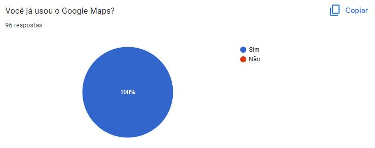
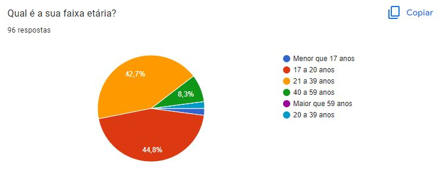
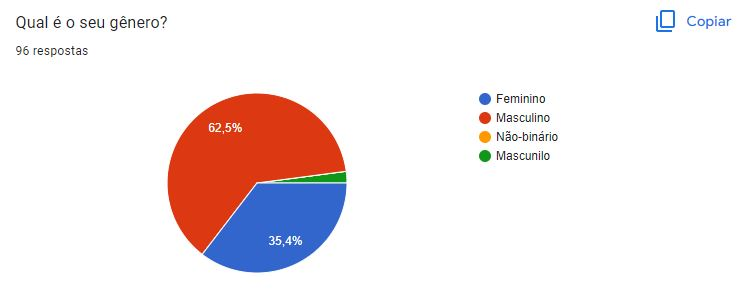
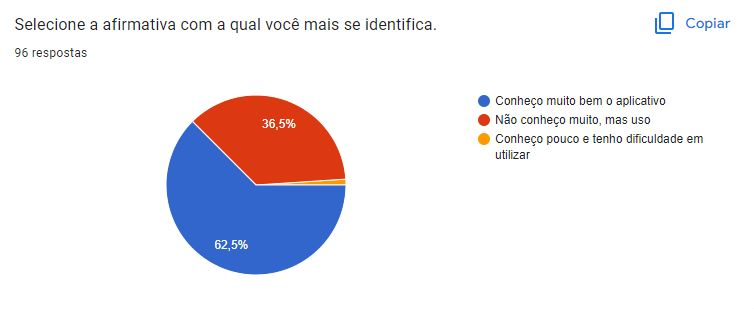
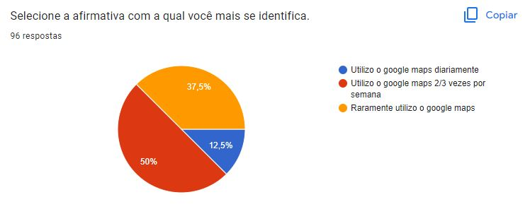
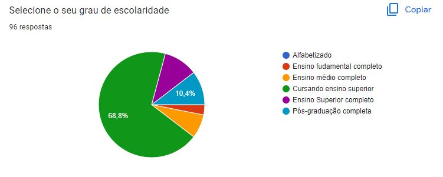
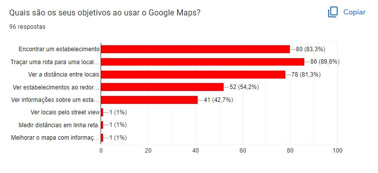
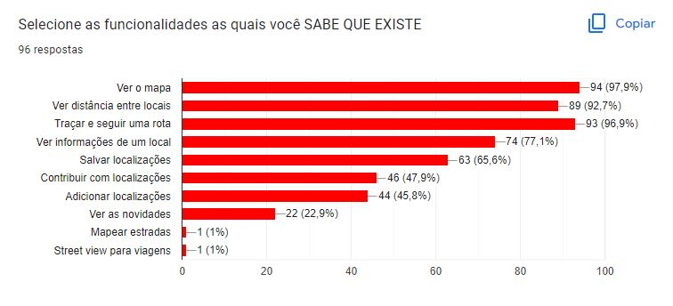
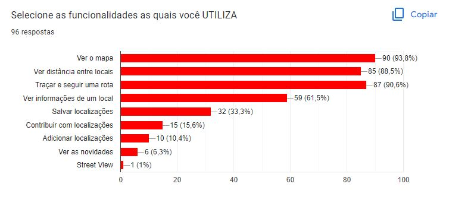
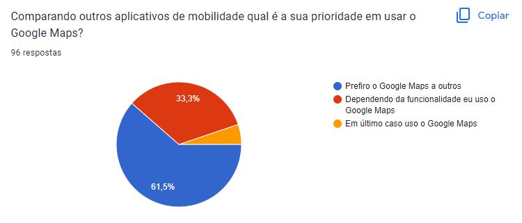

# Questionário

## 1. Introdução

&emsp;&emsp; A técnica de questionário visa obter informações de um público maior, que nem sempre possui disponibilidade para participar de uma entrevista e consegue-se realizar a análise de resultados de forma mais rápida.
 
## 2. Atividades realizadas
### 2.1 Preparação
&emsp;&emsp; É importante que na fase de preparação sejam elencados os objetivos, informaçẽs e qual o público-alvo para que o questionário seja respondido de forma coerente. Para aumentar a veracidade das perguntas o formulário não pediu identificação dos usuários, apenas informações sobre o perfil.

&emsp;&emsp; Dentro desse aspecto, o questionário pode ser montado com dois tipos de perguntas, as abertas que o entrevistado pode responder da maneira que ele considera melhor e fechadas que dão um direcionamento mais objetivo nas respostas. Utilizamos o Google Forms para fazer o questionário, nele preparamos perguntas fechadas e abertas ao mesmo tempo(híbridas) pois existiam opções, mas caso o respondente quisesse ele poderia adicionar uma opção ou mais. 

&emsp;&emsp; O questionário foi dividido em 3 partes: introdução e triagem, perfil do usuário e análise do aplicativo. Caso o usuário não tiver utilizado o Google Maps ele não pode responder o questionário.

### 2.2 Perguntas

&emsp;&emsp; Sendo assim, foram 6 questões de escolha única fechadas, 1 questão de escolha única híbrida, 3 questões de escolha múltipla híbridas e uma pergunta aberta. Abaixo estão as nossas perguntas e em seguida as opções, em caso de "Outro" o Google Forms abre uma caixa para escrita.

1. **Você já usou o Google Maps?** Sim ou Não.
2. **Qual é a sua faixa etária?** Menor que 17 anos; 17 a 20 anos; 21 a 39 anos; 40 a 59 anos; Maior que 59 anos.
3. **Qual é o seu gênero?**  Feminino, Masculino, Não-binário, Outros.
3. **Selecione a afirmativa com a qual você mais se identifica.** Conheço muito bem o aplicativo; Não conheço muito, mas uso; Conheço pouco e tenho dificuldade em utilizar.
4. **Selecione a afirmativa com a qual você mais se identifica.** Utilizo o google maps diariamente; Utilizo o google maps 2/3 vezes por semana; Raramente utilizo o google maps.
5. **Selecione o seu grau de escolaridade.** Alfabetizado; Ensino fudamental completo; Ensino médio completo; Cursando ensino superior; Ensino Superior completo; Pós-graduação completa.
6. **Quais são os seus objetivos ao usar o Google Maps?** Encontrar um estabelecimento; Traçar uma rota para uma localização; Ver a distância entre locais; Ver estabelecimentos ao redor de uma localização; Ver informações sobre um estabelecimento; Outros.
7. **Selecione as funcionalidades as quais você SABE QUE EXISTE.** Ver o mapa; Ver distância entre locais; Traçar e seguir uma rota; Ver informações de um local; Salvar localizações; Contribuir com localizações; Adicionar localizações; Ver as novidades; Outros.
8. **Selecione as funcionalidades as quais você UTILIZA.** Ver o mapa; Ver distância entre locais; Traçar e seguir uma rota; Ver informações de um local; Salvar localizações; Contribuir com localizações; Adicionar localizações; Ver as novidades; Outros.
9. **Comparando outros aplicativos de mobilidade qual é a sua prioridade em usar o Google Maps?** Prefiro o Google Maps a outros; Dependendo da funcionalidade eu uso o Google Maps; Em último caso uso o Google Maps.

### 2.3 Resultados

&emsp;&emsp; No dia da análise dos resultados (27/11/2022) foram obtidas 96 respostas. O questionário foi espalhado em grupos de redes sociais de diferentes ambientes para tentar obter os mais variados tipos de usuário. Os resultados obtidos foram: 

Pergunta 1: Como esperado somente quem já utilizou o aplicativo conseguiu responder ao questionário como pode ser observado na imagem abaixo.

<figure markdown >
  <figcaption>Figura 1 - Pergunta 1 do Google Forms</figcaption>
  </figure>

<figure markdown >

  <figcaption>Elaboração Própria</figcaption>
</figure>

Pergunta 2: A maior parte das respostas foi de 17 a 20 anos demonstrado no gráfico abaixo, porém foi uma diferença apenas de 2,1% entre o grupo 17 a 20 e o grupo 21 a 39 anos.

<figure markdown >
  <figcaption>Figura 2 - Pergunta 2 do Google Forms</figcaption>
  </figure>

<figure markdown >
  <figcaption>Elaboração Própria</figcaption>
</figure>

Pergunta 3: Inicialmente houve um erro ortográfico na opção masculino, como pode ser observado na figura 3, e algumas pessoas ainda selecionaram antes da correção, então definimos que os resultados de 'mascunilo' e 'Masculino' se referem ao mesmo grupo.

<figure markdown >
  <figcaption>Figura 3 - Pergunta 3 do Google Forms</figcaption>
  </figure>

<figure markdown >
  <figcaption>Elaboração Própria</figcaption>
</figure>

Pergunta 4: A maioria já conhecia o aplicativo e sabia utilizá-lo muito bem de acordo com a figura abaixo.

<figure markdown >
  <figcaption>Figura 4 - Pergunta 4 do Google Forms</figcaption>
  </figure>

<figure markdown >
  <figcaption>Elaboração Própria</figcaption>
</figure>

Pergunta 5: A maioria utiliza o Google Maps de 2/3 vezes por semana, como demonstrado na figura 5. 

<figure markdown >
  <figcaption>Figura 5 - Pergunta 5 do Google Forms</figcaption>
  </figure>

<figure markdown >
  <figcaption>Elaboração Própria</figcaption>
</figure>

Pergunta 6: A figura 6 mostra o gráfico o qual diz que a maioria está cursando o Ensino Superior.

<figure markdown >
  <figcaption>Figura 6 - Pergunta 6 do Google Forms</figcaption>
  </figure>

<figure markdown >
  <figcaption>Elaboração Própria</figcaption>
</figure>

Pergunta 7: A maioria utiliza o aplicativo para traçar uma rota para uma localização de acordo com a imagem abaixo.

<figure markdown >
  <figcaption>Figura 7 - Pergunta 7 do Google Forms</figcaption>
  </figure>

<figure markdown >
  <figcaption>Elaboração Própria</figcaption>
</figure>

Pergunta 8: A maioria conhece as funcionalidades de ver mapa(94) para traçar rota(93) tendo uma diferença de apenas uma seleção entre as duas opções como pode ser observado na figura 8.

<figure markdown >
  <figcaption>Figura 8 - Pergunta 8 do Google Forms</figcaption>
  </figure>

<figure markdown >
  <figcaption>Elaboração Própria</figcaption>
</figure>

Pergunta 9: A maioria utiliza a opção de ver mapa de acordo com a figura 9.

<figure markdown >
  <figcaption>Figura 9 - Pergunta 9 do Google Forms</figcaption>
  </figure>

<figure markdown >
  <figcaption>Elaboração Própria</figcaption>
</figure>

Pergunta 10: A maioria prefere o Google Maps a outros aplicativos como demonstra a figura 10. Abrimos uma pergunta aberta para que selecionasse as outras opções e recebemos respostas relacionadas a: familiaridade com outros aplicativos, informações de trânsito que o Google Maps não fornece, achar o navegador de outro aplicativo mais fácil, interface mais amigável, rotas melhores e afirmações sobre o Google Maps estar desatualizado. 

<figure markdown >
  <figcaption>Figura 10 - Pergunta 10 do Google Forms</figcaption>
  </figure>

<figure markdown >

  <figcaption>Elaboração Própria</figcaption>
</figure>

### 2.4 Finalização

Foi possível entender mais do perfil dos usuários que usam o aplicativo. Na tabela abaixo pode-se ver os requisitos que conseguimos coletar dos questionários:

| Descrição                                                                                             | Tipo  |
| ----------------------------------------------------------------------------------------------------- | ----- |
| Deve ser possível pesquisar um estabelecimento                                                        | RF01  |
| Deve ser possível traçar uma rota                                                                     | RF02  |
| Deve ser possível ver distância entre locais                                                          | RF03  |
| Deve ser possível ver estabelecimentos no mapa                                                        | RF04  |
| Deve ser possível ver informações sobre um estabelecimento                                            | RF05  |
| Deve ser possível navegar pelo mapa pelo modo street view                                             | RF06  |
| Deve ser possível melhorar o mapa adicionando informações de locais                                   | RF07  |
| Deve ser possível salvar localizações buscadas                                                        | RF08  |
| Deve ser possível ver novos comentários e avaliações de outros usuários de estabelecimentos quaisquer | RF09  |
| As rotas devem ser traçadas de acordo com as políticas de trânsito de cada cidade                     | RNF01 |

Fonte: Grupo 5

## 3. Histórico de versão

| Data       | Versão | Modificações                   | Autor(es)      | Revisor(es)        |
| :--------: | :----: | :---------------------------:  | :------------: | :----------------: |
| 24/11/2022 | 1.0    | Criação da pagina              | Luiza          |    Lucas Felipe    |
| 27/11/2022 | 2.0    | Complemento com resultados     | Alexia         |    Lucas Felipe    |
| 05/12/2022 | 3.0    | Adiciona tabela com requisitos | Alexia         |    Iago          |
