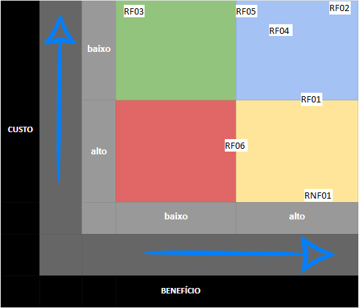

# Priorização

## 1. Introdução

&emsp;&emsp; A priorização é uma técnica de elicitação de requisitos que consiste em ordenar os requisitos de acordo com a importância que eles possuem para o usuário. Essa técnica é utilizada para que os requisitos mais importantes sejam implementados primeiro, e assim, o usuário possa utilizar o sistema com mais facilidade e rapidez.

## 2. Priorização

&emsp;&emsp; A priorização foi realizada através de três técnicas: MoSCoW, Custo x Benefício e BASICO. A seguir, serão apresentadas as técnicas utilizadas e os requisitos priorizados. Os requisitos utilizados são especificados na seção #4 página de [Entrevistas](5.entrevista.md).

### 2.1 BASICO

&emsp;&emsp; A técnica BASICO consiste em atribuir uma pontuação para cada requisito, de acordo com a sua importância, através de fatores elencados mais especificamente na página das [técnicas](técnicas%20de%20priorização/BASICO.md). Os requisitos A pontuação é dada de acordo com a tabela abaixo:

<figcaption align="center">Tabela 1: Requisitos em BASICO</figcaption>

| Requisito | B | A | S | I | C | O | Total |
| :---      |:--|:--|:--|:--|:--|:--| :---  |
| RF01      | 5 | 2 | 5 | 3 | 5 | 2 | 22    |
| RF02      | 5 | 4 | 5 | 1 | 1 | 4 | 20    |
| RF03      | 1 | 5 | 5 | 1 | 4 | 1 | 17    |
| RF04      | 5 | 2 | 5 | 2 | 5 | 4 | 23    |
| RF05      | 3 | 3 | 3 | 1 | 5 | 5 | 20    |
| RF06      | 2 | 5 | 5 | 5 | 5 | 1 | 23    |
| RNF01     | 5 | 5 | 4 | 5 | 5 | 3 | 27    |

<figcaption align="center">Fonte: Elaboração própria</figcaption>

&emsp;&emsp; Após a pontuação, os requisitos foram ordenados de acordo com a pontuação total, sendo o requisito com maior pontuação o mais importante. A sequência de priorização dos requisitos é apresentada da seguinte maneira: RNF01, RF04, RF06, RF01, RF05, RF02, RF03.

&emsp;&emsp; O link para o vídeo da aplicação da técnica BASICO pode ser acessado [aqui](https://youtu.be/Pq_891Akk_Y).

### 2.2 Custo x Benefício

&emsp;&emsp; A técnica Custo x Benefício consiste em apenas pegar os dados previstos para o seu projeto e encaixá-los nos quadrantes coloridos, melhor especificado na página de [técnicas](técnicas%20de%20priorização/Custo%20x%20Beneficio.md). Os requisitos foram colocados em cada quadrante de acordo com a sua importância e o seu custo. A tabela abaixo apresenta os requisitos em cada quadrante:

<figcaption align="center">Tabela 2: Requisitos em Custo x Benefício</figcaption>

<figcaption align="center">Fonte: Elaboração própria</figcaption>

&emsp;&emsp; O link para o vídeo da aplicação da técnica Custo x Benefício pode ser acessado [aqui](https://youtu.be/wPYxSMKpp8o).

### 2.3 MoSCoW

&emsp;&emsp; MoSCoW, que consiste em dividir os requisitos em quatro categorias: Must, Should, Could e Won't. Essas categorias são definidas de acordo com a importância que o requisito possui para o usuário. Os requisitos que são considerados essenciais para o sistema são classificados como Must, os requisitos que são importantes, mas não essenciais, são classificados como Should, os requisitos que são desejáveis, mas não essenciais, são classificados como Could e os requisitos que não são desejáveis, são classificados como Won't. Nos tópicos a seguir, serão elencadas as personas que foram entrevistadas e os requisitos que foram priorizados para cada uma delas.

#### 2.3.1 Manuel Gomes (persona primária)

  - Must - RF01, RF04, RNF01
  - Should - RF05, RF06
  - Could - RF02
  - Won’t - RF03

&emsp;&emsp; O link para o vídeo da aplicação da técnica MoSCoW com o Manuel Gomes pode ser acessado [aqui](https://youtu.be/cihl-itrQKk).

#### 2.3.2 Juliana Almeida (anti-persona)

  - Must - RF02, RF05, RNF01
  - Should - RF01
  - Could - RF06
  - Won’t - RF03, RF04

&emsp;&emsp; O link para o vídeo da aplicação da técnica MoSCoW com a Juliana Almeida pode ser acessado [aqui](https://youtu.be/8MzfqGi_kCk).

#### 2.3.3 Carolina Silveira (persona secundária)

  - Must - RF01, RF02, RF04
  - Should - RF05, RF06
  - Could -
  - Won’t - RF03, RNF01

&emsp;&emsp; O link para o vídeo da aplicação da técnica MoSCoW com a Carolina Silveira pode ser acessado [aqui](https://youtu.be/A-rQizDWEFw).

#### 2.3.4 Ricardo Mendes (persona secundária)

  - Must - RF01, RF02, RF05
  - Should - RF06
  - Could - RF04
  - Won’t - RF03, RNF01

&emsp;&emsp; O link para o vídeo da aplicação da técnica MoSCoW com o Ricardo Mendes pode ser acessado [aqui](https://youtu.be/RB4gYeuXv3c).

## 3. Conclusão

&emsp;&emsp;De acordo com as técnicas de priorização utilizadas, os requisitos mais importantes para o sistema são apresentados nessa sequência: RNF01, RF01, RF02, RF04, RF06, RF05, RF03. Esses requisitos foram priorizados de acordo com a importância que eles possuem para o usuário, sendo que os requisitos que possuem maior pontuação são os mais importantes.

## 4. Histórico de Versões

|Versão |    Data    |         Modificações         | Autor(es)      | Revisor(s)|
| ----- | ---------- |       ----------------       | -------------- | ------------ |
|  1.0  | 30/11/2022 |Criação da Página e Requisitos Priorizados| Iago e Marcus| QWERTY |
|  1.1  | 30/11/2022 |Adição de Vídeos de Aplicação| Iago e Marcus| QWERTY |
