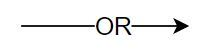

# NFR Framework

## 1. Introdução

&ensp;&ensp; "Característica abstrata, a qual se deseja considerar na análise, visando saber se a mesma será cumprida ou não cumprida, ou seja, escolhida ou não escolhida para ser implementada. Aqui, no fundo, são requisitos não funcionais, vistos como critérios/atributos de qualidade." (SERRANO, SERRANO, 2019).

## 2. Metodologia

Foi utilizado o site [Draw.io](https://app.diagrams.net/) para fazer os diagramas. Na tabela abaixo é possível ver a legenda dos diagramas.

| Imagem                                                                  | Legenda                                 |
| :---------------------------------------------------------------------- | :-------------------------------------- |
| {width="80" height="80"}      | Softgoal de NFR                         |
| {width="80" height="80"}       | Softgoal de Afirmação                   |
| {width="80" height="80"} | Softgoal de Operacionalização           |
| {width="80" height="80"}         | Contribuição HURT                       |
| {width="80" height="80"}         | Contribuição BREAK                      |
| {width="80" height="80"}         | Contribuição HELP                       |
| {width="80" height="80"}         | Contribuição MAKE                       |
| {width="80" height="80"}         | Contribuição AND                        |
| {width="80" height="80"}          | Contribuição OR                         |
| {width="80" height="80"}              | Parcialmente satisfeito                 |
| {width="80" height="80"}              | Parcialmente satisfeito                 |
| {width="80" height="80"}      | Satisfeito                              |
| {width="80" height="80"}          | Negado                                  |
| {width="80" height="80"}      | Indefinido                              |

## 3. NFR 

## 4. Histórico de versão

|    Data    | Versão |                          Modificações                           |    Autor(es)     | Revisor(es) |
| :--------: | :----: | :-------------------------------------------------------------: | :--------------: | :---------: |
| 18/12/2022 |  1.0   |                    Criação da página de NFR                     |      Alexia      |    Luiza    |

## 5. Bibliografia

> SERRANO, Milene; SERRANO, Mauricio. Requisitos – Aula 17. 2019. Disponível em: (link)[https://aprender3.unb.br/pluginfile.php/2307541/mod_resource/content/1/Requisitos%20-%20Aula%20019a.pdf] Acesso em: 18 jan. 2022