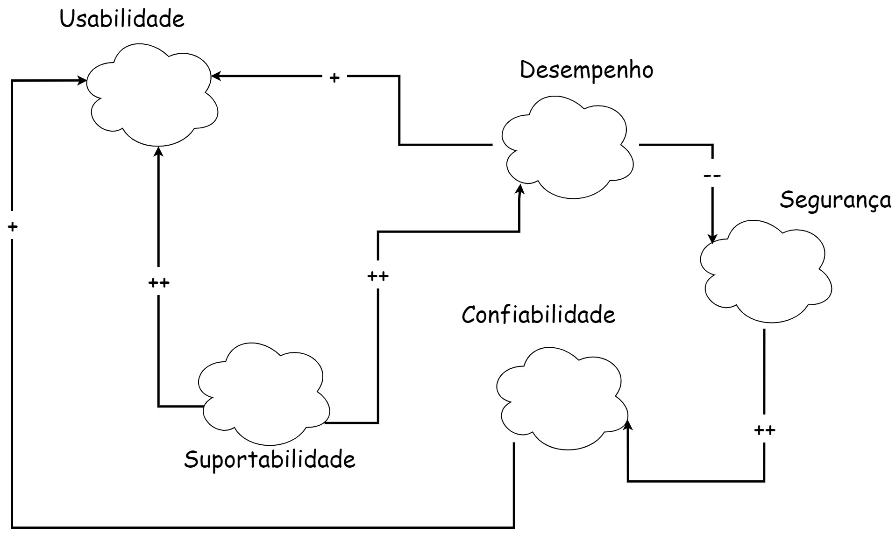
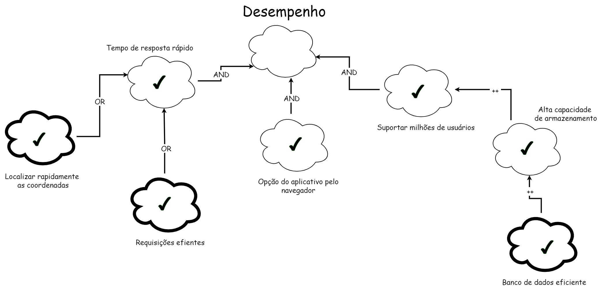
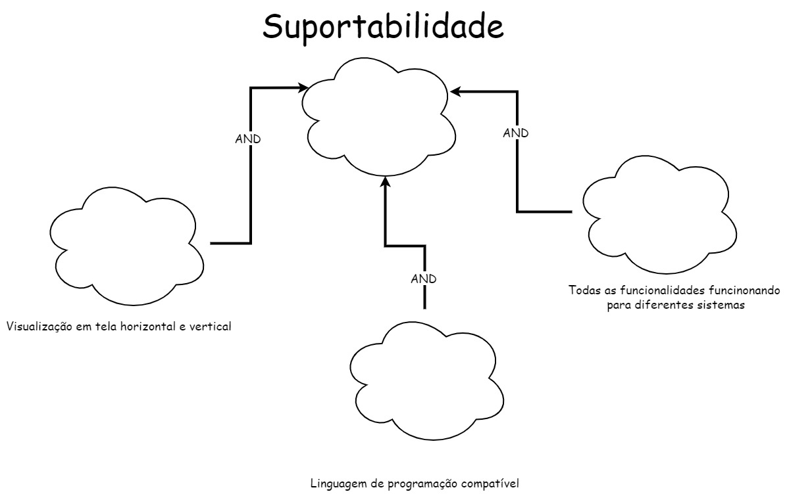

# NFR Framework

## 1. Introdução

&ensp;&ensp; "Característica abstrata, a qual se deseja considerar na análise, visando saber se a mesma será cumprida ou não cumprida, ou seja, escolhida ou não escolhida para ser implementada. Aqui, no fundo, são requisitos não funcionais, vistos como critérios/atributos de qualidade." (SERRANO, SERRANO, 2019).

### 1.1 Dicionário

- **softgoals** : Objetivo sem definição clara nem critérios de satisfação precisos (SILVA, 2019).
- **SIG** :  *Softgoal Interdependency Graph* e em português é Gráfico Interdependente de *softgoals*.

## 2. Metodologia

Foi utilizado o site [Draw.io](https://app.diagrams.net/) para fazer os diagramas. Na tabela abaixo é possível ver a legenda dos diagramas.

<figcaption align="center">Tabela 1: Legenda.</figcaption>

| Imagem                                                                  | Legenda                                 |
| :---------------------------------------------------------------------- | :-------------------------------------- |
| {width="80" height="80"}      | Softgoal de NFR                         |
| {width="80" height="80"}       | Softgoal de Afirmação                   |
| {width="80" height="80"} | Softgoal de Operacionalização           |
| {width="80" height="80"}         | Contribuição HURT                       |
| {width="80" height="80"}         | Contribuição BREAK                      |
| {width="80" height="80"}         | Contribuição HELP                       |
| {width="80" height="80"}         | Contribuição MAKE                       |
| {width="80" height="80"}         | Contribuição AND                        |
| {width="80" height="80"}          | Contribuição OR                         |
| {width="80" height="80"}      | Satisfeito                              |
| {width="80" height="80"}          | Negado                                  |
| {width="80" height="80"}      | Indefinido                              |

<figcaption>Fonte: Alexia</figcaption>

## 3. NFRF

### 3.1 Geral

Cada um dos *softgoals* abaixo irá ser destrinchado em mais *softgoals*, mas na Imagem 1 podemos observar como eles se relacionam. Os softgoals abaixo foram retirados da página de [Especificação Suplementar](../4.especificacao_suplementar/)

<figcaption align="center">Imagem 1: SIG Geral.</figcaption>

<figcaption>Fonte: Alexia</figcaption>

### 3.2 Usabilidade

 Foram utilizados os Requisitos Não-Funcionais localizados no [tópico de usabilidade da página de Especificação Suplementar](../4.especificacao_suplementar/#3-usabilidade).
 Na imagem 2 encontra-se o SIG de usabilidade:

<figcaption align="center">Imagem 2: SIG Usabilidade.</figcaption>

{width="650" height="650"}  

<figcaption>Fonte: Alexia</figcaption>

#### Propagação de Impactos

Na imagem 3 encontra-se o SIG de usabilidade com a propagação de impactos:

<figcaption align="center">Imagem 3: SIG Usabilidade - Propagação de Impactos.</figcaption>

{width="650" height="650"}  

<figcaption>Fonte: Alexia</figcaption>

### 3.3 Confiabilidade

Foram utilizados os Requisitos Não-Funcionais localizados no [tópico de confiabilidade da página de Especificação Suplementar](../4.especificacao_suplementar/#4-confiabilidade).
Na imagem 4 encontra-se o SIG de confiabilidade:

<figcaption align="center">Imagem 4: SIG Confiabilidade.</figcaption>

{width="650" height="650"}  

<figcaption>Fonte: Alexia</figcaption>

#### Propagação de Impactos

Na imagem 5 encontra-se o SIG de confiabilidade com a propagação de impactos:

<figcaption align="center">Imagem 5: SIG Confiabilidade - Propagação de Impactos.</figcaption>

{width="650" height="650"}

<figcaption>Fonte: Alexia</figcaption>

### 3.4 Desempenho

Foram utilizados os Requisitos Não-Funcionais localizados no [tópico de desempenho da página de Especificação Suplementar](../4.especificacao_suplementar/#5-desempenho).
Na imagem 6 encontra-se o SIG de desempenho:

<figcaption align="center">Imagem 6: SIG Desempenho </figcaption>

{width="650" height="650"}  

<figcaption>Fonte: Alexia</figcaption>

#### Propagação de Impactos

Na imagem 7 encontra-se o SIG de desempenho com a propagação de impactos:

<figcaption align="center">Imagem 7: SIG Desempenho - Propagação de Impactos.</figcaption>

{width="650" height="650"}

<figcaption>Fonte: Alexia</figcaption>

### 3.5 Suportabilidade

Foram utilizados os Requisitos Não-Funcionais localizados no [tópico de suportabilidade da página de Especificação Suplementar](../4.especificacao_suplementar/#6-suportabilidade).
Na imagem 8 encontra-se o SIG de suportabilidade:

<figcaption align="center">Imagem 8: SIG Suportabilidade </figcaption>

{width="650" height="650"}  

<figcaption>Fonte: Alexia</figcaption>

#### Propagação de Impactos

Na imagem 9 encontra-se o SIG de suportabilidade com a propagação de impactos:

<figcaption align="center">Imagem 9: SIG Suportabilidade - Propagação de Impactos.</figcaption>

{width="650" height="650"}

<figcaption>Fonte: Alexia</figcaption>

## 4. Histórico de versão

|    Data    | Versão |                          Modificações                           |    Autor(es)     | Revisor(es) |
| :--------: | :----: | :-------------------------------------------------------------: | :--------------: | :---------: |
| 18/12/2022 |  1.0   |                    Criação da página de NFR                     |      Alexia      |    Luiza    |

## 5. Bibliografia

> SERRANO, Milene; SERRANO, Mauricio. Requisitos – Aula 17. 2019. Disponível em: [link](https://aprender3.unb.br/pluginfile.php/2307541/mod_resource/content/1/Requisitos%20-%20Aula%20019a.pdf) Acesso em: 18 jan. 2022

> SILVA, R. **NFR4ES: Um Catálogo de Requisitos Não-Funcionais para Sistemas Embarcados**. Tese (Mestrado em Engenharia de Software) - Centro de Informática, Universidade Federal de Pernambuco. Recife, p. 155. 2019. Acesso em: 18 jan. 2022