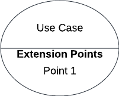

# Casos de Uso

## 1. Introdução

&emsp;&emsp;O Diagrama de Caso de uso é uma representação das interações entre o usuário e o sistema. Dentro desse modelo, existem vários símbolos que representam diferentes estruturas e atividades.

&emsp;&emsp;Esse diagrama auxilia na discussã de cenários e definição de metas e escopo que o sistema atenderá. Por não ter tantos detalhes, geralmente o diagrama é acompanhado de uma descrição.

## 2. Metodologias

&emsp;&emsp; Após a realização da elicitação, foi possível levantar as principais atividades do sistema que precisariam estar dentro da modelagem do diagrama. Para fazê-lo, foi definido como ferramenta o LucidChart, que possui os componentes necessários.

### 2.1.Elementos do diagrama

&emsp;&emsp;É importante que fique claro o que cada elemento dentro da diagramação significa. A Tabela 1 abaixo identifica cada ponto dentro dos diagramas elaborados:

<figcaption align="center">Tabela 1: Descrição de elementos do diagrama</figcaption>

|       Nome        |                                          Função                                           |                                    Elemento                                     |
| :---------------: | :---------------------------------------------------------------------------------------: | :-----------------------------------------------------------------------------: |
|       Ator        |                 Representam usuários que fazem a interação com o sistema                  |          {width="40" height="40"}          |
|    Caso de uso    |                  Representam os diferentes usos que o usuário pode fazer                  |        {width="80" height="80"}         |
| Ponto de extensão | Representam sequências de comportamento que fazem descrição de um comportamento adicional |    {width="100" height="100"}     |
|  Relacionamentos  |                 Mostram quais atores se relacionam com quais casos de uso                 | {width="100" height="100"} |
| Limite do sistema |                         Define até onde o sistema tem seu escopo                          |      {width="100" height="100"}       |

<figcaption align="center">Fonte: Autoria Própria </figcaption>

## 3. Diagramas UML

### 3.1. Diagrama de "Ver mapa"

&emsp;&emsp; O diagrama tratado na figura 1 aborda uma visão de interação entre o sistema e o usuário quanto os requisitos relacionados com o acesso ao mapa. Tais requisitos coletados na seção de [Elicitação](https://requisitos-de-software.github.io/2022.2-GoogleMaps/elicitacao/2.perfil/), descrevem as necessidades do usuário em poder alterar o tipo de mapa, utilizar o GPS para descrever sua localização atual, além de se obter melhor detalhes no mapa.

<figcaption>Figura 1: Diagrama de "ver mapa"</figcaption>

{width="600" height="100"}

<figcaption>Fonte: Lucas e Luciano</figcaption> 

|       UC01        | Procurar sua localização                                           |
| :---------------: | ------------------------------------------------------------------ |
|     Descrição     | O usuário deve ser capaz de procurar um local específico fácil.    |
|       Ator        | Usuário                                                            |
|   Pré-condições   | Aplicativo instalado e internet conectada                          |
|  Fluxo Principal  | O usuário apenas deve abrir o aplicativo e pesquisar por um local. |
| Fluxo Alternativo | O usuário busca um local direto no mapa                            |
|   Pós-condições   | O usuário deve vializar seu local                                  |
|  Rastreabilidade  | RF                                                                 |

| Passo | Ação                                                             | Fluxo     | Sequência |
| ----- | ---------------------------------------------------------------- | --------- | :-------: |
| 1     | Usuário acessa o mapa do aplicativo                              | Principal |     -     |
| 2     | Usuário procura sua localização no mapa                          | Principal |     -     |
| 3     | O sistema pede autorização para acessar a localização do usuário | Principal |     -     |

## 3.2.Diagrama de "Pesquisar local"

&emsp;&emsp; O diagrama tratado na figura 2 aborda uma visão de interação entre o sistema e o usuário quanto os requisitos relacionados com a pesquisa de local. Tais requisitos coletados na seção de [Elicitação](https://requisitos-de-software.github.io/2022.2-GoogleMaps/elicitacao/2.perfil/), descrevem as necessidades do usuário em poder buscar um determinado local, salvar local, buscar detalhes acerca de cada local e para aqueles locais em que há a possibilidade o modo de ligação.

<figcaption align="center">Figura 2: Diagrama de "Pesquisar local"</figcaption>

{width="600" height="100"}

<figcaption>Fonte: Lucas e Luciano</figcaption> 

## 3.3.Diagrama de "Traçar rota"

&emsp;&emsp; O diagrama tratado na figura 3 aborda uma visão de interação entre o sistema e o usuário quanto os requisitos relacionados com a pesquisa de local. Tais requisitos coletados na seção de [Elicitação](https://requisitos-de-software.github.io/2022.2-GoogleMaps/elicitacao/2.perfil/), descrevem as necessidades do usuário em poder traçar rotas, contendo locais de partida e chegada, o tempo de percursso e distância de acordo com o meio de transporte escolhido, o modo navegação que permite uma facilidade de utilização da rota além de se poder buscar locais pertencentes a rota estabelicida.

<figcaption align="center">Figura 3: Diagrama de "traçar rota"</figcaption>

{width="600" height="100"}

<figcaption>Fonte: Lucas e Luciano</figcaption> 

## 4. Histórico de Versão

|    Data    | Versão |                   Modificações                   |       Autor(es)        |   Revisor(es)   |
| :--------: | :----: | :----------------------------------------------: | :--------------------: | :-------------: |
| 08/12/2022 |  1.0   |        Criação da página de Casos de Uso         |         Lucas          | Luiza e Luciano |
| 08/12/2022 |  2.0   | Criação dos textos e tabelas sobre a diagramação |         Luíza          |      Iago       |
| 08/12/2022 |  2.1   |       Criação dos diagramas de caso de uso       |    Lucas e Luciano     |      Iago       |
| 08/12/2022 |  2.2   |      Criação da especificação dos diagramas      | Lucas, Luiza e Luciano |      Iago       |

## 5. Bibliográfia

> SERRANO, Milene; SERRANO, Maurício. Requisitos - Aula 13. Brasília: Unb-Gama, 2017. 35 slides, color. Disponível em: [link](https://aprender3.unb.br/pluginfile.php/2307510/mod_resource/content/1/Requisitos%20-%20Aula%20013a.pdf). Acesso em: 08 dez. 2022.

> Lucid Chart; Diagrama de caso de uso UML: O que é, como fazer e exemplos. Disponível em: [link](https://www.lucidchart.com/pages/pt/diagrama-de-caso-de-uso-uml). Acesso em: 08 dez. 2022.
