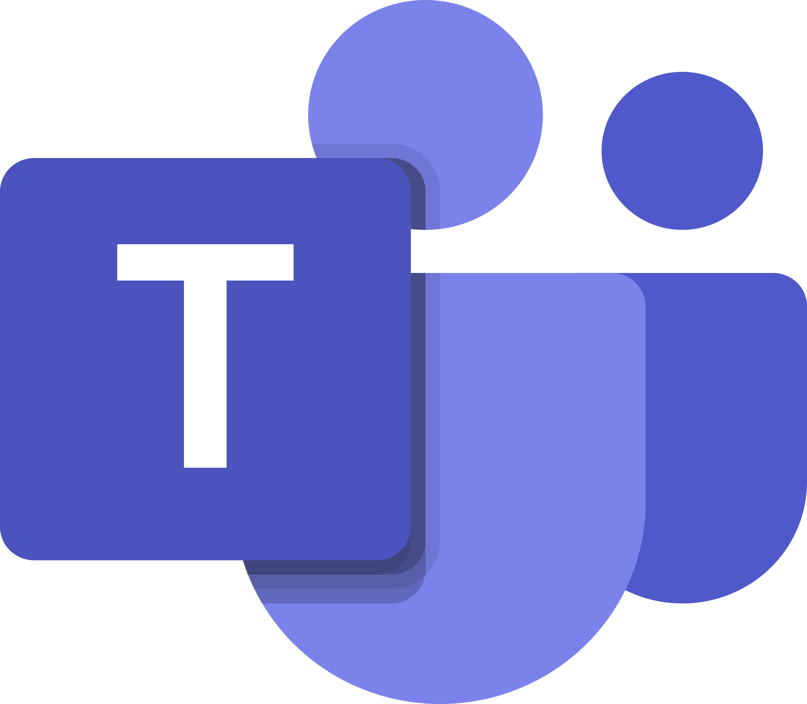
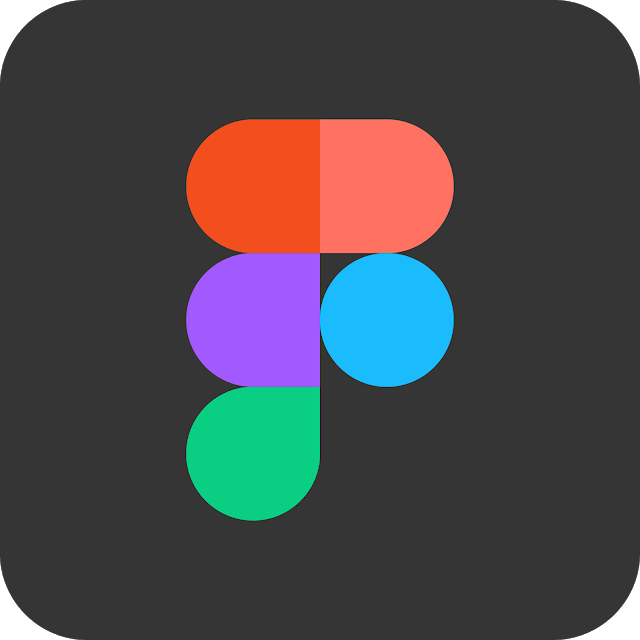

# Planejamento

## 1. Metodologias

### 1.1 Introdução

&emsp;&emsp;O objetivo deste documento é trazer um breve resumo dos diversos aspectos e cerimônias de metodologias ágeis que foram selecionadas com o intuito de auxiliar no desenvolvimento do projeto.

### 1.2 Scrum

&emsp;&emsp;O Scrum é uma das metodologias mais famosas dentro das metodologias ágeis, sendo uma estrutura na qual se usa a agilidade para pensar, realizar e validar/entregar tarefas aos clientes, assim como de ajuda para melhorar a comunicação e o trabalho em equipe no dia a dia do desenvolvimento, estimulando o aprendizado com experiências e organização, refletindo sobre êxitos e fracassos.

#### 1.2.1 Product Backlog

&emsp;&emsp; Product Backlog trata-se de uma ferramenta onde se é inserida todas as atividades do projeto. Possibilitando-se assim, um melhor planejamento de execução das mesmas.

#### 1.2.2 Sprint

&emsp;&emsp;Sprint trata-se de um período de uma semana, destinada a execução de um determinado escopo de atividades.

#### 1.2.3 Sprint Planning

&emsp;&emsp;Sprint Planning trata-se de um planejamento de atividades definidas para cada semana e os responsáveis pela execução das mesmas. A planning será feita toda quinta-feira após a review.

#### 1.2.4 Sprint Review

&emsp;&emsp;Sprint Review trata-se de uma cerimônia onde toda a equipe de desenvolvimento tem a oportunidade de mostrar como foi a execução das atividades definidas para a semana e sugerir eventuais melhorias para as próximas sprints. A review será feita toda quinta-feira 20:00.

#### 1.2.5 Issues

&emsp;&emsp;Issues tratam-se de cada atividade planejada para as sprints, com os responsáveis pela execução das mesmas, o que se espera de entregável para cada uma destas e porque estas atividades devem ser feitas. Em geral, são atividades voltadas para pesquisa, revisão e produção de variados artefatos.

### 1.3 eXtreme Programming

&emsp;&emsp;eXtreme Programming, ou mais conhecido como XP, é uma metodologia ágil voltada para o desenvolvimento de um produto de software de alta qualidade e proporcionando ainda assim o bem-estar da equipe de desenvolvimento. XP prepara sua equipe de produção à uma eventual mudança no escopo do produto. Uma característica desta metodologia é que ela não é usada apenas pelo time de desenvolvedores, mas também por clientes e gerentes.

#### 1.3.1 Pair Programming (Programação em Pares)

&emsp;&emsp;Sempre que possível, designamos duas pessoas para fazer uma atividade ao mesmo tempo, diminuindo assim a possibilidade/urgência de revisão, fazendo com que duas cabeças pensem ao mesmo tempo, facilitando o progresso e a melhora do trabalho, compartilhando conhecimento e fortalecendo o pertencimento ao projeto.

#### 1.3.2 Simple Design

&emsp;&emsp;É imprescindível usarmos de linguagem simples e clara, não somente para comunicação interna mas também para entendimento do cliente e de quem estiver acessando o projeto, tornando-se um projeto digitalmente acessível a todos.

#### 1.3.3 Move People Around

&emsp;&emsp;Também relacionado às duplas de programação, o rodízio de pessoas é necessário com o objetivo de uniformizar não somente o padrão de escrita e design, mas também o padrão de pensamento de todos da equipe, podendo explorar ao máximo o potencial do pair programming.

#### 1.3.4 40 Hour Week

&emsp;&emsp;Somos à favor de um trabalho saudável e tranquilo para todos os membros do grupo, por isso, acreditamos que é necessário deixar a equipe livre para trabalhar, assim como livre para descansar, evitando a sobrecarga e fornecendo condições e ambientes favoráveis à todos os membros. "Trabalhe 100% durante o trabalho e descanse a 100% no resto. Se algum deles não for feito com 100%, um afetará o outro."

### 1.4 KanBan

&emsp;&emsp;KanBan é um método de gerenciamento de fluxo de trabalho que ajuda organizações a administrar e melhorar sistemas de trabalho. Muito utilizado para visualização do que deve ser feito, estaremos utilizando aspectos que facilitam o controle de trabalho por sprints, tal como sua situação e prioridade.

#### 1.4.1 Limite de Trabalho em Progresso (WIP)

&emsp;&emsp;Pelo KanBan, trazemos o aspecto do limite de trabalho, ou seja, sem integrantes do grupo fazendo muitas tarefas ao mesmo tempo em uma mesma sprint, dividindo o trabalho uniformemente pelos membros e ao longo do semestre, possibilitando uma carga saudável e prática a todos.

#### 1.4.2 Controle de Atividades (to-do, doing, done)

&emsp;&emsp;O KanBan permite que as colunas criadas sejam organizadas conforme a necessidade de cada equipe. Nós, como equipe, vimos apenas a necessidade de dividir as issues em três labels básicas: to-do, in progress ou done. Essa prática facilita o rastreamento do andamento das issues, o que ainda precisa ser feito no momento como prioridade, e o que não tem tanta urgência assim.

## 2. Política de Branches e Commits

&emsp;&emsp;Seguiremos a seguinte lógica para ser seguida na inserção de atividades feitas pelas issues:

1. Criar uma branch com nome significativo com a atividade da issue a ser realizada;
2. Fazer commits granulares e significativos seguindo o padrão "verbo + atividade realizada no commit". Ex.: "inserção da página de planejamento", "criação da tabela de ferramentas";
3. Ao finalizar a atividade feita na branch, abrir um pull request com a intenção de ter a atividade revisada por outro membro do grupo;
4. Ao final do documento deixaremos no histórico de versão, a data com a versão executada, os autores e a descrição da atividade feita. Mais além, serão apresentados também os revisores de cada uma destas atividades;
5. Após a revisão, caso o PR esteja de acordo com o que deve ser feito, além de correções menores a serem feitas, a solicitação é aceita e as mudanças irão para a branch principal.

## 3. Cronograma

## 4. Ferramentas

### 4.1 Introdução
    
&emsp;&emsp; As ferramentas serão softwares que serão utilizados pela equipe com os objetivos de melhorar o desenvolvimento, comunicação e o gerenciamento do projeto. 

### 4.2 Ferramentas utilizadas

Tabela 1: Ferramentas utilizadas no projeto

|                                       Logo                                        |     Ferramenta     | Finalidade                                                                                                  |
| :-------------------------------------------------------------------------------: | :----------------: | ----------------------------------------------------------------------------------------------------------- |
|     {width="128" height="128"}     |       Github       | Será utilizado como repositório dos documentos produzidos e para o versionamento dos mesmos.                |
|   {width="128" height="128"}   |      Telegram      | Utilizado para comunicação entre o grupo e com o monitor                                                    |
|   {width="200" height="128"}    |     Lucidchart     | Será utilizado para a criação dos diversos diagramas e esquemas necessários para a modelagem dos Requisitos |
|      {width="135" height="135"}       |      Youtube       | Utilizado para armazenar as gravações das apresentações dos pontos de controle                              |
| {width="128" height="128"} |  Microsoft Teams   | Utilizado para as apresentações e reuniões do time.                                                         |
|       {width="128" height="128"}        | Visual Code Studio | Utilizado para elaboração dos documentos.                                                                   |
|      {width="128" height="128"}      |       Figma        | Utilizado para elaborar os protótipos de média e alta fidelidade                                            |

## 5. Histórico de versão

| Data  | Versão | Modificações | Autor(es) | Revisor(es) |
| :---: | :----: | :----------: | :-------: |: -----:    |
| 08/11/2022 | 1.0 | Criação da página e inserção de metodologias/política de branches e commits | Iago Campelo e Lucas Felipe | Luciano Freitas e Luiza Esteves |
| 15/11/2022 | 2.0| Criação da página de ferramentas | Lucas Felipe | Marcus Martins|
| 23/11/2022 | 3.0| Atualização da página de ferramentas | Lucas Felipe | Marcus Martins|
      

## 6. Bibliografia

- [Scrum](https://www.atlassian.com/br/agile/scrum)
- [eXtreme Programming](https://www.devmedia.com.br/extreme-programming-conceitos-e-praticas/1498#Programming)
- [KanBan](https://kanbanize.com/kanban-resources/getting-started/what-is-kanban)
